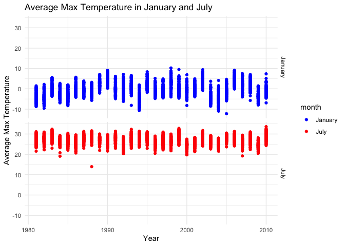
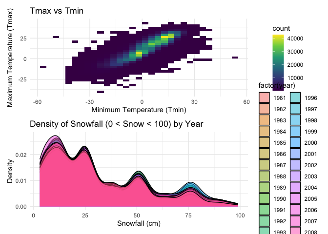
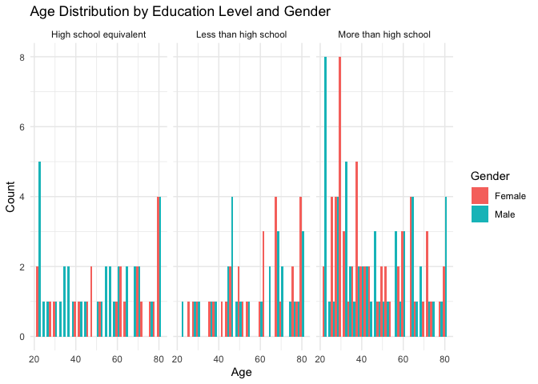
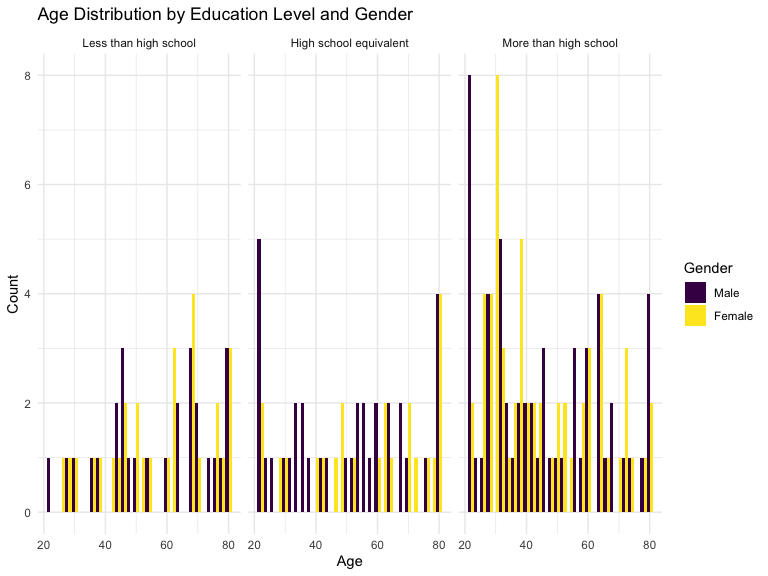

p8105_hw3_jc6422
================
Jianing Chen
2024-10-09

## Problem 1

load the data from packages

``` r
library(p8105.datasets)
library(tidyverse)
```

    ## ── Attaching core tidyverse packages ──────────────────────── tidyverse 2.0.0 ──
    ## ✔ dplyr     1.1.4     ✔ readr     2.1.5
    ## ✔ forcats   1.0.0     ✔ stringr   1.5.1
    ## ✔ ggplot2   3.5.1     ✔ tibble    3.2.1
    ## ✔ lubridate 1.9.3     ✔ tidyr     1.3.1
    ## ✔ purrr     1.0.2     
    ## ── Conflicts ────────────────────────────────────────── tidyverse_conflicts() ──
    ## ✖ dplyr::filter() masks stats::filter()
    ## ✖ dplyr::lag()    masks stats::lag()
    ## ℹ Use the conflicted package (<http://conflicted.r-lib.org/>) to force all conflicts to become errors

``` r
library(ggplot2)
library(patchwork)
data("ny_noaa")
```

data cleaning

``` r
ny_noaa_df = ny_noaa |>
  mutate(
    date = as.Date(date),
    year = year(date),
    month = month(date),
    day = day(date),
    tmax = as.numeric(tmax) / 10,  
    tmin = as.numeric(tmin) / 10,  
    prcp = as.numeric(prcp) / 10,
    snow = snow
  ) %>%
  filter(!is.na(tmax) & !is.na(tmin) & !is.na(snow) & !is.na(prcp)) 

ny_noaa_df
```

    ## # A tibble: 1,274,995 × 10
    ##    id          date        prcp  snow  snwd  tmax  tmin  year month   day
    ##    <chr>       <date>     <dbl> <int> <int> <dbl> <dbl> <dbl> <dbl> <int>
    ##  1 USC00300023 1981-01-03   0       0     0 -12.2 -20.6  1981     1     3
    ##  2 USC00300023 1981-01-05   0       0     0  -5.6 -17.8  1981     1     5
    ##  3 USC00300023 1981-01-12   0       0     0 -12.2 -30.6  1981     1    12
    ##  4 USC00300023 1981-01-13   0       0     0  -6.7 -28.9  1981     1    13
    ##  5 USC00300023 1981-01-15   0       0     0  -5   -10.6  1981     1    15
    ##  6 USC00300023 1981-01-17   0       0     0  -1.1 -15    1981     1    17
    ##  7 USC00300023 1981-01-20   0       0     0   6.1  -6.7  1981     1    20
    ##  8 USC00300023 1981-01-21   0       0     0   1.7 -10.6  1981     1    21
    ##  9 USC00300023 1981-01-22   0       0     0   0.6  -5    1981     1    22
    ## 10 USC00300023 1981-01-23  11.7   127    76   2.2  -4.4  1981     1    23
    ## # ℹ 1,274,985 more rows

This data has 1274995 rows and 10 columns. The variables are id, date,
prcp, snow, snwd, tmax, tmin, year, month, day.

Make a two-panel plot showing the average max temperature in January and
in July in each station across years.

``` r
january = ny_noaa_df %>% 
  filter(month == 1)

july = ny_noaa_df %>% 
  filter(month == 7)

jan_avg_tmax = january %>% 
  group_by(id, year) %>% 
  summarize(avg_tmax = mean(tmax, na.rm = TRUE))%>%
  mutate(month="January")
```

    ## `summarise()` has grouped output by 'id'. You can override using the `.groups`
    ## argument.

``` r
jul_avg_tmax = july %>% 
  group_by(id, year) %>% 
  summarize(avg_tmax = mean(tmax, na.rm = TRUE))%>%
  mutate(month="July")
```

    ## `summarise()` has grouped output by 'id'. You can override using the `.groups`
    ## argument.

``` r
combined_data = bind_rows(jan_avg_tmax, jul_avg_tmax)

ggplot(combined_data, aes(x = as.numeric(year),y=avg_tmax)) +
  geom_point(aes( color = month)) +
  labs(title = "Average Max Temperature in January and July", 
       x = "Year", 
       y = "Average Max Temperature") +
  facet_grid(month~.) +
  scale_color_manual(values = c("January" = "blue", "July" = "red")) +
  theme_minimal()
```

<!-- -->

Observations:

The blue plot represents the distribution of average maximum
temperatures in January. This structure suggests relatively stable
temperatures with some fluctuation over time.

The red plot represents the distribution of average maximum temperatures
in July. This structure is also relatively stable. There is an outlier
in 1988.

Make a two-panel plot showing :

1)  tmax vs tmin for the full dataset
2)  make a plot showing the distribution of snowfall values greater than
    0 and less than 100 separately by year.

``` r
p1 = ggplot(ny_noaa_df, aes(x = tmin, y = tmax)) +
  geom_bin2d(bins = 30) +
  scale_fill_viridis_c() +
  labs(title = "Tmax vs Tmin", x = "Minimum Temperature (Tmin)", y = "Maximum Temperature (Tmax)") +
  theme_minimal()

snow_filtered = ny_noaa_df %>%
  filter(snow > 0 & snow < 100)

p2 = ggplot(snow_filtered, aes(x = snow, fill = factor(year))) +
  geom_density(alpha = 0.5) +  
  labs(title = "Density of Snowfall (0 < Snow < 100) by Year", x = "Snowfall (cm)", y = "Density") +
  theme_minimal()

combined_plot = p1 / p2

combined_plot
```

<!-- -->

## Problem 2

Load and clean the datasets.

``` r
accel = read_csv("data/nhanes_accel.csv")
```

    ## Rows: 250 Columns: 1441
    ## ── Column specification ────────────────────────────────────────────────────────
    ## Delimiter: ","
    ## dbl (1441): SEQN, min1, min2, min3, min4, min5, min6, min7, min8, min9, min1...
    ## 
    ## ℹ Use `spec()` to retrieve the full column specification for this data.
    ## ℹ Specify the column types or set `show_col_types = FALSE` to quiet this message.

``` r
covar = read_csv("data/nhanes_covar.csv",skip = 4) 
```

    ## Rows: 250 Columns: 5
    ## ── Column specification ────────────────────────────────────────────────────────
    ## Delimiter: ","
    ## dbl (5): SEQN, sex, age, BMI, education
    ## 
    ## ℹ Use `spec()` to retrieve the full column specification for this data.
    ## ℹ Specify the column types or set `show_col_types = FALSE` to quiet this message.

``` r
colnames(covar) = c("SEQN", "sex", "age", "BMI", "education")
merged_data = accel %>%
  left_join(covar, by = "SEQN") %>%
  filter(age >= 21, !is.na(education), !is.na(sex), !is.na(age))
merged_data
```

    ## # A tibble: 231 × 1,445
    ##     SEQN  min1  min2  min3  min4   min5   min6   min7   min8    min9  min10
    ##    <dbl> <dbl> <dbl> <dbl> <dbl>  <dbl>  <dbl>  <dbl>  <dbl>   <dbl>  <dbl>
    ##  1 62161 1.11  3.12  1.47  0.938 1.60   0.145  2.10   0.509   1.63   1.20  
    ##  2 62164 1.92  1.67  2.38  0.935 2.59   5.22   2.39   4.90    1.97   3.13  
    ##  3 62169 5.85  5.18  4.76  6.48  6.85   7.24   6.12   7.48    5.47   6.49  
    ##  4 62174 5.42  3.48  3.72  3.81  6.85   4.45   0.561  1.61    0.698  2.72  
    ##  5 62177 6.14  8.06  9.99  6.60  4.57   2.78   7.10   7.25   10.1    7.49  
    ##  6 62178 0.167 0.429 0.131 1.20  0.0796 0.0487 0.106  0.0653  0.0564 0.0639
    ##  7 62180 0.039 0     0     0     0.369  0.265  0.506  0.638   0      0.011 
    ##  8 62184 1.55  2.81  3.86  4.76  6.10   7.61   4.74   6.73    5.42   4.24  
    ##  9 62189 2.81  0.195 0.163 0     0.144  0.180  0.870  0.214   0      0     
    ## 10 62191 2.84  2.44  2.36  1.87  2.33   1.63   0.0654 1.42    0.984  0.499 
    ## # ℹ 221 more rows
    ## # ℹ 1,434 more variables: min11 <dbl>, min12 <dbl>, min13 <dbl>, min14 <dbl>,
    ## #   min15 <dbl>, min16 <dbl>, min17 <dbl>, min18 <dbl>, min19 <dbl>,
    ## #   min20 <dbl>, min21 <dbl>, min22 <dbl>, min23 <dbl>, min24 <dbl>,
    ## #   min25 <dbl>, min26 <dbl>, min27 <dbl>, min28 <dbl>, min29 <dbl>,
    ## #   min30 <dbl>, min31 <dbl>, min32 <dbl>, min33 <dbl>, min34 <dbl>,
    ## #   min35 <dbl>, min36 <dbl>, min37 <dbl>, min38 <dbl>, min39 <dbl>, …

Create a table for the number of men and women in each education
category:

``` r
merged_data = merged_data %>%
  mutate(
    sex = case_when(
      sex == 1 ~ "Male",
      sex == 2 ~ "Female"
    ),
    education = case_when(
      education == 1 ~ "Less than high school",
      education == 2 ~ "High school equivalent",
      education == 3 ~ "More than high school"
    )
  )
table = merged_data %>%
  group_by(education, sex) %>%
  summarise(count = n()) %>%
  pivot_wider(names_from = sex, values_from = count, values_fill = 0)
```

    ## `summarise()` has grouped output by 'education'. You can override using the
    ## `.groups` argument.

``` r
table
```

    ## # A tibble: 3 × 3
    ## # Groups:   education [3]
    ##   education              Female  Male
    ##   <chr>                   <int> <int>
    ## 1 High school equivalent     23    36
    ## 2 Less than high school      29    28
    ## 3 More than high school      59    56

The table represents the distribution of men and women across different
education categories. In the category “Less than high school,” there are
28 men and 29 women. For “More than high school,” there are 56 men and
59 women, and for “high school equivalent”, there are 36 men and 23
women. This suggests a relatively balanced gender distribution across
education levels.

Create a visualization of the age distributions for men and women in
each education category.

``` r
ggplot(merged_data, aes(x = age, fill = sex)) +
  geom_histogram(binwidth = 2, position = "dodge") +
  facet_wrap(~education) +
  labs(
    title = "Age Distribution by Education Level and Gender",
    x = "Age",
    y = "Count",
    fill = "Gender"
  ) +
  theme_minimal()
```

<!-- -->

The histogram represents the distribution of ages for both men and women
across different education categories. The “High school equivalent”
group shows a broader age range, with a higher number of individuals in
older age categories.The “Less than high school” group has a more
dispersed age distribution with fewer individuals, but males tend to
dominate in the older age categories. The “More than high school”
education group is clearly the largest, with a more defined clustering
of individuals in middle age, which could indicate that those with
higher education tend to be younger in this dataset. Gender
representation is fairly balanced across the categories, although there
are slight differences in certain age brackets within each education
group.

Make plots to compare men to women and have separate panels for each
education level.

``` r
total_activity_data = merged_data %>%
  mutate(total_activity = rowSums(select(., starts_with("min")), na.rm = TRUE)) %>%
  group_by(SEQN, sex, age, education) %>%
  summarise(total_activity = sum(total_activity, na.rm = TRUE)) %>%
  ungroup()
```

    ## `summarise()` has grouped output by 'SEQN', 'sex', 'age'. You can override
    ## using the `.groups` argument.

``` r
ggplot(total_activity_data, aes(x = age, y = total_activity, color = sex)) +
  geom_point(alpha = 0.6) +
  geom_smooth(method = "loess", se = FALSE) + # Using loess for a smooth trend line
  facet_wrap(~education) +
  labs(
    title = "Total Activity vs Age by Education Level and Gender",
    x = "Age",
    y = "Total Activity",
    color = "Gender"
  ) +
  theme_minimal()
```

    ## `geom_smooth()` using formula = 'y ~ x'

<!-- -->

All of the three plots show that total physical activity generally
decreases with age for both men and women across all education levels.

Women generally exhibit higher activity levels than men in middle age
(30-50), while men experience a steeper decline in activity after age 60
compared to women.

The group with more education shows more consistent activity patterns in
middle age, while those with less education display a sharper drop in
activity from age 40 onwards.
