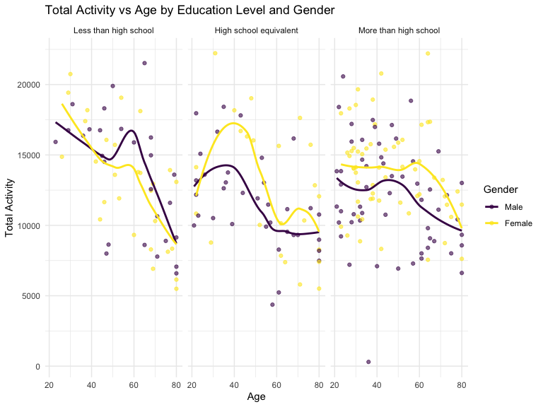

p8105_hw3_jc6422
================
Jianing Chen
2024-10-09

## Problem 1

load the data from packages

``` r
library(p8105.datasets)
library(tidyverse)
```

    ## ── Attaching core tidyverse packages ──────────────────────── tidyverse 2.0.0 ──
    ## ✔ dplyr     1.1.4     ✔ readr     2.1.5
    ## ✔ forcats   1.0.0     ✔ stringr   1.5.1
    ## ✔ ggplot2   3.5.1     ✔ tibble    3.2.1
    ## ✔ lubridate 1.9.3     ✔ tidyr     1.3.1
    ## ✔ purrr     1.0.2     
    ## ── Conflicts ────────────────────────────────────────── tidyverse_conflicts() ──
    ## ✖ dplyr::filter() masks stats::filter()
    ## ✖ dplyr::lag()    masks stats::lag()
    ## ℹ Use the conflicted package (<http://conflicted.r-lib.org/>) to force all conflicts to become errors

``` r
library(ggplot2)
library(patchwork)
library(ggridges)

knitr::opts_chunk$set(
    echo = TRUE,
    warning = FALSE,
    fig.width = 8, 
  fig.height = 6,
  out.width = "90%"
)

theme_set(theme_minimal() + theme(legend.position = "bottom"))

options(
  ggplot2.continuous.colour = "viridis",
  ggplot2.continuous.fill = "viridis"
)

scale_colour_discrete = scale_colour_viridis_d
scale_fill_discrete = scale_fill_viridis_d
```

``` r
data("ny_noaa")
```

This dataset contains 2595176 rows and 7 columns. Variables include
weather station id, date of observation, (tenths of mm), snowfall (mm),
snow depth (mm), and min and max temperature (tenths of degrees C).

Below we clean the data, creating separate variables for year, month,
and day and converting `tmax` and `tmin` to numeric. We find that 0 is
the most commonly observed value for snowfall. This is because most days
of the year, it does not snow at all in NY. The second most commonly
observed value is `NA`, indicating missingness. Other common values are
13, 25, and 51, suggesting that snowfall is originally recorded in
fractions of an inch and converted to mm.

data cleaning

``` r
ny_noaa %>% 
  count(snow) %>%
  arrange(desc(n))
```

    ## # A tibble: 282 × 2
    ##     snow       n
    ##    <int>   <int>
    ##  1     0 2008508
    ##  2    NA  381221
    ##  3    25   31022
    ##  4    13   23095
    ##  5    51   18274
    ##  6    76   10173
    ##  7     8    9962
    ##  8     5    9748
    ##  9    38    9197
    ## 10     3    8790
    ## # ℹ 272 more rows

``` r
ny_noaa = 
  ny_noaa %>% 
  separate(date, into = c("year", "month", "day"), convert = TRUE) %>% 
  mutate(
    tmax = as.numeric(tmax),
    tmin = as.numeric(tmin))
```

Make a two-panel plot showing the average max temperature in January and
in July in each station across years.

``` r
ny_noaa %>% 
  group_by(id, year, month) %>% 
  filter(month %in% c(1, 7)) %>% 
  summarize(mean_tmax = mean(tmax, na.rm = TRUE, color = id)) %>% 
  ggplot(aes(x = year, y = mean_tmax, group = id)) + geom_point() + geom_path() +
  facet_grid(~month) +
  labs(title = "Mean monthly temperature for each station across years for January and July")
```

    ## `summarise()` has grouped output by 'id', 'year'. You can override using the
    ## `.groups` argument.


Observations:

This plot showing the average max temperature in January and in July in
each station across years. The mean temperature in January is much lower
than the mean temperature in July for all stations and across all years.
All stations appear to follow similar trends of temperature peaks and
valleys within a month across the years, When one station has a high
monthly mean temperature for a given year, most other stations also have
a high monthly mean temperature for that year. There is an outlier in
July of 1987 or 1988, as well as a few other less drastic outliers.

Make a two-panel plot showing :

1)  tmax vs tmin for the full dataset
2)  make a plot showing the distribution of snowfall values greater than
    0 and less than 100 separately by year.

``` r
hex = 
  ny_noaa %>% 
  ggplot(aes(x = tmin, y = tmax)) + 
  geom_hex()

ridge = 
  ny_noaa %>% 
  filter(snow < 100, snow > 0) %>%
  ggplot(aes(x = snow, y = as.factor(year))) + 
  geom_density_ridges()

hex + ridge
```

    ## Picking joint bandwidth of 3.76


From the hex plot we see that while there is some variability, the
majority of the data cluster tightly in the center of the distribution.
In relatively rare cases, it seems that `tmax` is less than `tmin`.

From the ridge plot, we see a multimodal density of snowfall within a
given year. Most stations see between 0 and 35 mm of snow in a year.
Then there is a another group of stations that see about 45 mm of snow,
and another group that sees nearly 80 mm. It is likely this
multimodality stems from the conversion of measurements in one system
(fractions of an inch) to another (using the metric system), which was
also noted in the table of common values.

## Problem 2

Load and clean the datasets.

``` r
accel = read_csv("data/nhanes_accel.csv",na = c(".", "NA", ""))%>%
  janitor::clean_names()
```

    ## Rows: 250 Columns: 1441
    ## ── Column specification ────────────────────────────────────────────────────────
    ## Delimiter: ","
    ## dbl (1441): SEQN, min1, min2, min3, min4, min5, min6, min7, min8, min9, min1...
    ## 
    ## ℹ Use `spec()` to retrieve the full column specification for this data.
    ## ℹ Specify the column types or set `show_col_types = FALSE` to quiet this message.

``` r
covar = read_csv("data/nhanes_covar.csv",na = c(".", "NA", ""),skip = 4) %>%
  janitor::clean_names() %>%
  drop_na()
```

    ## Rows: 250 Columns: 5
    ## ── Column specification ────────────────────────────────────────────────────────
    ## Delimiter: ","
    ## dbl (5): SEQN, sex, age, BMI, education
    ## 
    ## ℹ Use `spec()` to retrieve the full column specification for this data.
    ## ℹ Specify the column types or set `show_col_types = FALSE` to quiet this message.

``` r
merged_data = left_join(covar,accel, by = "seqn") %>%
  filter(age >= 21) %>%
    mutate(
    sex = factor(sex, levels = c(1, 2), 
                 labels = c("Male", "Female")),
    education = factor(education, levels = c(1, 2, 3), 
                       labels = c("Less than high school", "High school equivalent", "More than high school"))
    )
```

The cleaned merge data has 228 rows and 1445 columns. The variables are
seqn, sex, age, bmi, education, MIMS values for each minutes of a
24-hour day.

Create a table for the number of men and women in each education
category:

``` r
table = merged_data %>%
  group_by(education, sex) %>%
  summarise(count = n()) %>%
  pivot_wider(names_from = sex, values_from = count, values_fill = 0)
```

    ## `summarise()` has grouped output by 'education'. You can override using the
    ## `.groups` argument.

``` r
table
```

    ## # A tibble: 3 × 3
    ## # Groups:   education [3]
    ##   education               Male Female
    ##   <fct>                  <int>  <int>
    ## 1 Less than high school     27     28
    ## 2 High school equivalent    35     23
    ## 3 More than high school     56     59

``` r
knitr::kable(table, align = 'c')
```

|       education        | Male | Female |
|:----------------------:|:----:|:------:|
| Less than high school  |  27  |   28   |
| High school equivalent |  35  |   23   |
| More than high school  |  56  |   59   |

The table represents the distribution of men and women across different
education categories. In the category “Less than high school,” there are
28 men and 29 women. For “More than high school,” there are 56 men and
59 women, and for “high school equivalent”, there are 36 men and 23
women. This suggests a relatively balanced gender distribution across
education levels.

Create a visualization of the age distributions for men and women in
each education category.

``` r
ggplot(merged_data, aes(x = age, fill = sex)) +
  geom_histogram(binwidth = 2, position = "dodge") +
  facet_wrap(~education) +
  labs(
    title = "Age Distribution by Education Level and Gender",
    x = "Age",
    y = "Count",
    fill = "Gender"
  ) +
  theme_minimal()
```


The histogram represents the distribution of ages for both men and women
across different education categories. The “High school equivalent”
group shows a broader age range, with a higher number of individuals in
older age categories.The “Less than high school” group has a more
dispersed age distribution with fewer individuals, but males tend to
dominate in the older age categories. The “More than high school”
education group is clearly the largest, with a more defined clustering
of individuals in middle age, which could indicate that those with
higher education tend to be younger in this dataset. Gender
representation is fairly balanced across the categories, although there
are slight differences in certain age brackets within each education
group.

Make plots to compare men to women and have separate panels for each
education level.

``` r
total_activity_data = merged_data %>%
  mutate(total_activity = rowSums(select(., starts_with("min")), na.rm = TRUE)) %>%
  group_by(seqn, sex, age, education) %>%
  summarise(total_activity = sum(total_activity, na.rm = TRUE)) %>%
  ungroup()
```

    ## `summarise()` has grouped output by 'seqn', 'sex', 'age'. You can override
    ## using the `.groups` argument.

``` r
ggplot(total_activity_data, aes(x = age, y = total_activity, color = sex)) +
  geom_point(alpha = 0.6) +
  geom_smooth(method = "loess", se = FALSE) + # Using loess for a smooth trend line
  facet_wrap(~education) +
  labs(
    title = "Total Activity vs Age by Education Level and Gender",
    x = "Age",
    y = "Total Activity",
    color = "Gender"
  ) +
  theme_minimal()
```

    ## `geom_smooth()` using formula = 'y ~ x'



All of the three plots show that total physical activity generally
decreases with age for both men and women across all education levels.

Women generally exhibit higher activity levels than men in middle age
(30-50), while men experience a steeper decline in activity after age 60
compared to women.

The group with more education shows more consistent activity patterns in
middle age, while those with less education display a sharper drop in
activity from age 40 onwards.

Make a three-panel plot that shows the 24-hour activity time courses for
each education level and use color to indicate sex.

``` r
long_data = merged_data %>%
  pivot_longer(cols = starts_with("min"), 
               names_to = "minute", 
               values_to = "activity") %>%
  mutate(minute = as.numeric(str_remove(minute, "min")))

activity_plot = ggplot(long_data, aes(x = minute, y = activity, color = sex)) +
  geom_line(alpha = 0.5) +  
  geom_smooth(se = FALSE) + 
  facet_wrap(.~education) +  
  labs(
    title = "24-Hour Activity Time Course by Education Level and Gender",
    x = "Time (minutes from midnight)",
    y = "Activity",
    color = "sex"
  ) +
  theme_minimal()

activity_plot
```

    ## `geom_smooth()` using method = 'gam' and formula = 'y ~ s(x, bs = "cs")'


Higher education levels correlate with more sustained physical activity
throughout the day. In contrast, those with less than a high school
education exhibit lower overall activity levels.

Females generally display more consistent and evenly distributed
activity patterns throughout the day across all education levels. Their
activity shows fewer extreme peaks and dips compared to males. However,
Males, particularly those with more education, show larger spikes in
activity, particularly in the morning and late afternoon, indicating
potential differences in work schedules or exercise habits.

The graph shows a typical daily activity cycle for all groups, with
noticeable peaks in the morning and evening, and a lull during midday.
This pattern likely corresponds to work-related activities, commuting,
or exercise routines.

## Problem 3

Load and clean the datasets

``` r
jan_2020 = read_csv("data/citibike/Jan 2020 Citi.csv",na = c(".", "NA", "")) %>%
  janitor::clean_names() %>%
  mutate(year = 2020, month = "January") %>%
  select(year,month,everything())
```

    ## Rows: 12420 Columns: 7
    ## ── Column specification ────────────────────────────────────────────────────────
    ## Delimiter: ","
    ## chr (6): ride_id, rideable_type, weekdays, start_station_name, end_station_n...
    ## dbl (1): duration
    ## 
    ## ℹ Use `spec()` to retrieve the full column specification for this data.
    ## ℹ Specify the column types or set `show_col_types = FALSE` to quiet this message.

``` r
jan_2024 = read_csv("data/citibike/Jan 2024 Citi.csv",na = c(".", "NA", "")) %>%
  janitor::clean_names() %>%
  mutate(year = 2024, month = "January")%>%
  select(year,month,everything())
```

    ## Rows: 18861 Columns: 7
    ## ── Column specification ────────────────────────────────────────────────────────
    ## Delimiter: ","
    ## chr (6): ride_id, rideable_type, weekdays, start_station_name, end_station_n...
    ## dbl (1): duration
    ## 
    ## ℹ Use `spec()` to retrieve the full column specification for this data.
    ## ℹ Specify the column types or set `show_col_types = FALSE` to quiet this message.

``` r
july_2020 = read_csv("data/citibike/July 2020 Citi.csv",na = c(".", "NA", "")) %>%
  janitor::clean_names() %>%
  mutate(year = 2020, month = "July") %>%
  select(year,month,everything())
```

    ## Rows: 21048 Columns: 7
    ## ── Column specification ────────────────────────────────────────────────────────
    ## Delimiter: ","
    ## chr (6): ride_id, rideable_type, weekdays, start_station_name, end_station_n...
    ## dbl (1): duration
    ## 
    ## ℹ Use `spec()` to retrieve the full column specification for this data.
    ## ℹ Specify the column types or set `show_col_types = FALSE` to quiet this message.

``` r
july_2024 = read_csv("data/citibike/July 2024 Citi.csv",na = c(".", "NA", "")) %>%
  janitor::clean_names() %>%
  mutate(year = 2024, month = "July") %>%
  select(year,month,everything())
```

    ## Rows: 47156 Columns: 7
    ## ── Column specification ────────────────────────────────────────────────────────
    ## Delimiter: ","
    ## chr (6): ride_id, rideable_type, weekdays, start_station_name, end_station_n...
    ## dbl (1): duration
    ## 
    ## ℹ Use `spec()` to retrieve the full column specification for this data.
    ## ℹ Specify the column types or set `show_col_types = FALSE` to quiet this message.

``` r
citi_bike_data = bind_rows(jan_2020, jan_2024, july_2020, july_2024) %>%
  drop_na()
```

This data has 99253 rows and 9 columns. The variables are year, month,
ride_id, rideable_type, weekdays, duration, start_station_name,
end_station_name, member_casual.

Produce a reader-friendly table showing the total number of rides in
each combination of year and month separating casual riders and Citi
Bike members.

``` r
total_rides = citi_bike_data %>%
  group_by(year, month, member_casual) %>%
  summarise(count = n()) %>%
  pivot_wider(
    names_from = member_casual,
    values_from = count,
    values_fill = 0
  )
```

    ## `summarise()` has grouped output by 'year', 'month'. You can override using the
    ## `.groups` argument.

``` r
total_rides
```

    ## # A tibble: 4 × 4
    ## # Groups:   year, month [4]
    ##    year month   casual member
    ##   <dbl> <chr>    <int>  <int>
    ## 1  2020 January    980  11418
    ## 2  2020 July      5625  15388
    ## 3  2024 January   2094  16705
    ## 4  2024 July     10843  36200

``` r
knitr::kable( total_rides,
    col.names = c("Year", "Month",  "Casual Riders", "Citi Bike Member"),
    align = 'c')
```

| Year |  Month  | Casual Riders | Citi Bike Member |
|:----:|:-------:|:-------------:|:----------------:|
| 2020 | January |      980      |      11418       |
| 2020 |  July   |     5625      |      15388       |
| 2024 | January |     2094      |      16705       |
| 2024 |  July   |     10843     |      36200       |

As the table shows that there is an increasing trend of usage of citi
bike from 2020 to 2024, especially among members. This could suggest
that as the Citi Bike system expands and improves, more people are
opting for memberships to take advantage of lower rates and more
frequent rides. Casual riders, while increasing in number, still form a
smaller proportion of overall usage, primarily using the system in peak
months like July.

Make a table showing the 5 most popular starting stations for July 2024;
include the number of rides originating from these stations.

``` r
pop_stations = citi_bike_data %>%
  filter(year==2024, month == "July") %>%
  count(start_station_name) %>%
  top_n(5, wt = n)
  
pop_stations
```

    ## # A tibble: 5 × 2
    ##   start_station_name           n
    ##   <chr>                    <int>
    ## 1 Pier 61 at Chelsea Piers   163
    ## 2 University Pl & E 14 St    155
    ## 3 W 21 St & 6 Ave            152
    ## 4 W 31 St & 7 Ave            145
    ## 5 West St & Chambers St      150

``` r
knitr::kable(pop_stations,
    col.names = c("start station name", "Number of rides"),
    align = 'c') 
```

|    start station name    | Number of rides |
|:------------------------:|:---------------:|
| Pier 61 at Chelsea Piers |       163       |
| University Pl & E 14 St  |       155       |
|     W 21 St & 6 Ave      |       152       |
|     W 31 St & 7 Ave      |       145       |
|  West St & Chambers St   |       150       |

The 5 most popular stating stations in July 2024 are Pier 61 at Chelsea
Piers, University Pl & E 14 St, W 21 St & 6 Ave, W 31 St & 7 Ave and
West St & Chambers St.

Make a plot to investigate the effects of day of the week, month, and
year on median ride duration.

``` r
median_duration = citi_bike_data %>%
  group_by(weekdays, year, month) %>%
  summarise(median_duration = median(duration,na.rm = TRUE))
```

    ## `summarise()` has grouped output by 'weekdays', 'year'. You can override using
    ## the `.groups` argument.

``` r
median_duration_plot = median_duration |>
  ggplot(aes(x = weekdays, y = median_duration, color = month)) +
  geom_line(aes(group = interaction(year, month))) +
  facet_wrap(. ~ year) + 
  labs(title = "Median Ride Duration by Day of the Week, Month, and Year",
       x = "Day of the Week",
       y = "Median Ride Duration (minutes)",
       color = "Month")

median_duration_plot
```


This plot shows that median ride duration in July are generally longer
than in January. These four lines have an increasing trend from Monday
to Saturday and decreasing from Saturday to Sunday. In both 2020 and
2024, we see that the weekend days (Saturday and Sunday) have higher
median ride duration in July compared to the weekdays. This further
supports the idea that weekend rides in summer are likely more
recreational, with users taking longer trips for leisure purposes.
Comparing the two years, we observe that 2024 shows a more consistent,
indicating an evolving user base that may be utilizing Citi Bike more
frequently for various purposes.

For data in 2024, make a figure that shows the impact of month,
membership status, and bike type on the distribution of ride duration.

``` r
citi_bike_2024 = citi_bike_data %>%
  filter(year == 2024)

figure = ggplot(citi_bike_2024, aes(x = duration, fill = member_casual)) +
  geom_density(alpha = 0.5) +
  facet_grid(rideable_type ~ month) +
  labs(
    title = "Density of Ride Duration by Month, Membership, and Bike Type",
    x = "Ride Duration (minutes)",
    fill = "Membership"
  ) +
  theme_minimal()

figure
```


By this density plot, we can observe that the majority of rides are
clustered within 0-50 minutes range, which indicates that most rides,
whether by casual or member users, are short, with casual riders tending
to take slightly longer rides.

The member riders have a higher peak than casual riders, which suggests
that members tend to take a short rides more frequently.

There are no major seasonal differences in ride duration distribution,
but electric bike rides tend to be slightly shorter and more uniform.
